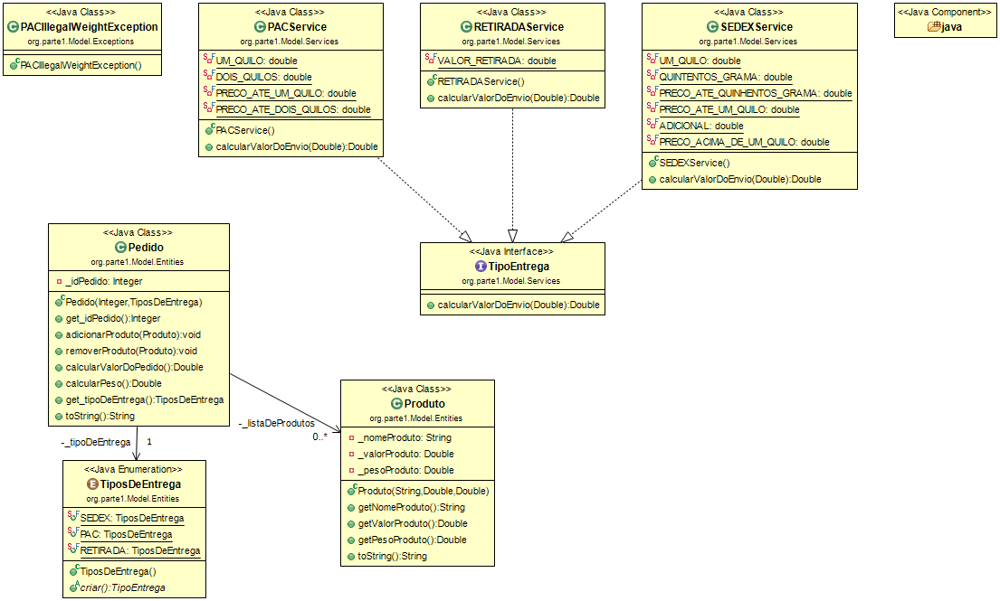

Trabalho de Análise de Algoritmos - Parte I

---

Neste trabalho, ultilizamos Java para implementar uma solução de cálculo de frete para uma livraria imaginária aplicando os conceitos aprendidos na aula.

Cada pedido pode conter múltiplos produtos. Cada produto possui: Nome, Valor e Peso

O sistema permite calcular o valor total do pedido considerando também o custo de entrega. As modalidades de entrega disponíveis são: PAC, SEDEX e Retirada no Local

Cada modalidade possui regras próprias de cálculo baseadas no peso total do pedido.

---

Design Patterns Utilizados

Strategy

    O cálculo do valor de entrega foi implementado utilizando o padrão Strategy.

    Cada tipo de entrega possui sua própria implementação de cálculo:

    `PACService`
    `SEDEXService`
    `RETIRADAService`

    Todas implementam a interface `TipoEntrega`, permitindo que diferentes algoritmos de cálculo de frete sejam substituídos sem alterar o restatnte do sistema.

Factory Method

    A criação das estratégias de entrega é realizada através do enum `TiposDeEntrega`, que possui o método `criar()`.
    Esse método é responsável por instanciar a implementação correta da interface `TipoEntrega`.

    Isso evita o uso de condicionais (if, else, switch) espalhadas pelo código e centraliza a criação das estratégias.

---

Clean Code

    Práticas aplicadas no código: 

    * Uso de nomes claros e descritivos para classes, métodos e variáveis
    * Substituição de números mágicos por constantes
    * Separação de responsabilidades entre entidades e serviços
    * Métodos pequenos com responsabilidades bem definidas

---

Object Calisthenics

    Regras que consideramos durante a implementação:

    * Encapsulamento da coleção de produtos dentro da classe `Pedido`
    * Métodos com responsabilidade única
    * Redução de lógica condicional através do uso de polimorfismo
    * Classes com responsabilidades bem definidas

---

Tratamento de Exceções

    Foi criada uma exceção personalizada (`PACIllegalWeightException`) para representar a regra de negócio em que pedidos com peso superior a 2kg não podem ser enviados via PAC. Permitindo assim mostrar as regras de demónio de uma forma explícita no código.

---

Testes

    Foram criados testes unitários utilizando JUnit para validar o funcionamento das regras de cálculo de entrega e garantir o comportamento esperado do sistema.

---

Diagrama de Classes

