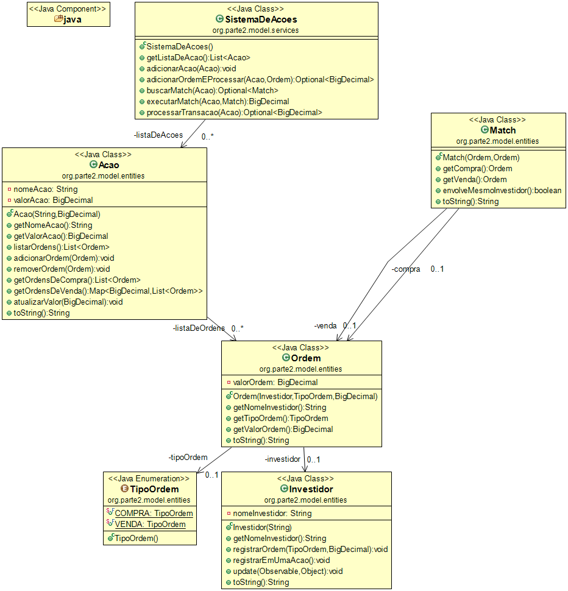

Trabalho Análise de Algoritmos - Parte II

---

Neste trabalho, utilizamos Java para implementar uma simulação de sistema de bolsa de valores, aplicando conceitos de modelagem de domínio e organização de código.

O sistema simula o funcionamento básico de uma bolsa de valores, permitindo o registro de ordens de compra e venda de ações. Quando há compatibilidade entre ordens (mesmo valor e investidores diferentes), o sistema realiza automaticamente a transação (*match*), removendo as ordens envolvidas e atualizando o valor da ação com base na última negociação.

Cada ação possui: Nome, Valor e sua lista de Ordens. O sistema também permite que investidores se registrem para receber notificações sempre que houver alteração no valor de uma ação.

---

Design Patterns Utilizados

Observer

```
O padrão Observer foi utilizado para implementar o sistema de notificações.
Quando o valor de uma ação é atualizado após uma transação, todos os investidores registrados são notificados automaticamente.
A implementação segue o conceito de desacoplamento entre quem gera o evento (ação) e quem reage a ele (investidores).
```

---

Clean Code

```
Práticas aplicadas no código:

* Separação clara de responsabilidades entre entidades e serviços
* Métodos pequenos e com responsabilidade única (SRP)
* Uso de nomes descritivos e consistentes (padrão camelCase)
* Uso de Optional para evitar retornos nulos
* Encapsulamento das estruturas internas (evitando exposição direta de listas)
```

---

Object Calisthenics

```
Regras consideradas durante a implementação:

* Classes com responsabilidades bem definidas e coesas
* Métodos curtos e com baixo nível de complexidade
* Evitar múltiplos níveis de indentação desnecessários
* Evitar exposição direta de coleções internas
* Separação entre dados (entidades) e regras de negócio (serviços)
```

---

Testes

```
Foram criados testes unitários utilizando JUnit para validar:

* Execução correta das transações (match de ordens)
* Atualização do valor das ações após negociação
* Comportamento esperado do sistema em cenários com e sem correspondência de ordens
```

---

Diagrama de Classes


