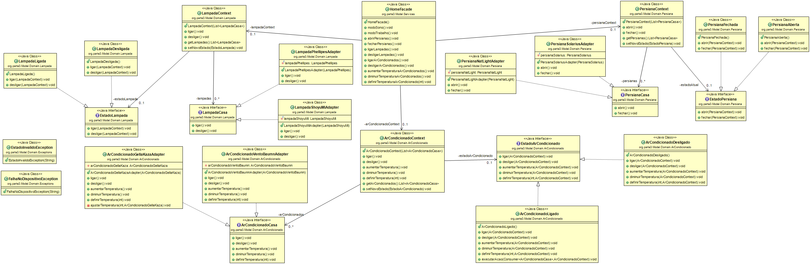

Trabalho de Análise de Algoritmos - Parte III

---

Neste trabalho, utilizamos Java para implementar uma solução de casa inteligente, aplicando os conceitos aprendidos em aula.

O sistema permite ao usuário controlar de forma simples os dispositivos da casa, contando com um sistema universal de controle e modos de uso pré-definidos.

---

Problemas/Solução

    O código inicial apresentava excesso de if's, alto acoplamento, presença de God Object e dependências mal distribuídas entre classes e métodos.

    Utilizando conceitos de Programação Orientada a Objetos e os conteúdos estudados em sala, foi possível evoluir o sistema para uma solução mais organizada, desacoplada e de melhor qualidade.

    As principais abordagens utilizadas foram:

---

Design Patterns Utilizados

 - Facade

        A interface principal do sistema utiliza o padrão Facade.

        Seu objetivo é simplificar o uso do sistema, escondendo a complexidade interna e oferecendo métodos de alto nível para o usuário.

 - State

        Os dispositivos possuem comportamentos diferentes dependendo do seu estado (ligado/desligado, aberto/fechado, etc).

        Para lidar com isso, foi utilizado o padrão State.

        Esse padrão permite encapsular o comportamento de cada estado em classes específicas, eliminando condicionais e tornando o código mais organizado e extensível.

 - Adapter

       Cada dispositivo possui uma API própria, com métodos e comportamentos diferentes.

       Para criar um sistema de controle unificado, foi utilizado o padrão Adapter.

       Com isso, foi definida uma interface comum para os dispositivos, permitindo que todos sejam controlados de forma padronizada, enquanto a lógica específica de cada um fica encapsulada nos adapters.

 - Context (Strategy)

       Para evitar que a Facade se tornasse uma God Class, foi introduzido o conceito de Context.

       O Context é responsável por manter a referência dos dispositivos e delegar as operações para o estado atual.

       Ele atua como um ponto central de controle, trabalhando em conjunto com o padrão State.

---

Clean Code

    Para manter a qualidade do código, foram aplicados princípios de Clean Code:

     - Nomes significativos para variáveis e métodos  
     - Funções com responsabilidade única (Single Responsibility)  
     - Baixo número de parâmetros por método  
     - Uso de exceções para tratamento de erros  
     - Separação clara de responsabilidades entre classes

---

Object Calisthenics

    Para atender às regras de Object Calisthenics, foram aplicadas as seguintes práticas:

     - Apenas um nível de identação por método  
     - Evitar o uso de else  
     - Redução de if's e switch's, substituindo por polimorfismo  
     - Apenas um ponto por linha  
     - Nomes descritivos (sem abreviações)  
     - Classes pequenas e com responsabilidade bem definida  
     - Evitar classes com muitos atributos  
     - Redução do uso desnecessário de getters e setters

---

Refactoring

    Para melhorar a qualidade do código, foram aplicadas as seguintes refatorações:

     - Remoção de código duplicado (ex: loops repetidos no controle de ar-condicionado, substituídos por um método genérico)  
     - Substituição de condicionais por polimorfismo (Replace Conditional with Polymorphism)  
     - Redução de métodos com muitos parâmetros, utilizando o Context como intermediário  
     - Criação de exceções personalizadas para melhor tratamento de erros

---

Tratamento de Exceções

    Foram implementadas exceções personalizadas para representar erros do domínio:

    "EstadoInvalidoException": lançada quando uma operação é chamada em um estado inválido do dispositivo

    "FalhaNoDispositivoException": utilizada para tratar falhas provenientes dos dispositivos (ex: erro ao executar operação na persiana)

---

Testes

    Foram implementados testes automatizados conforme solicitado no enunciado, cobrindo:

     - Chamadas individuais de cada dispositivo  
     - Execução do modo trabalho  
     - Execução do modo sono

---

Diagrama de Classes

